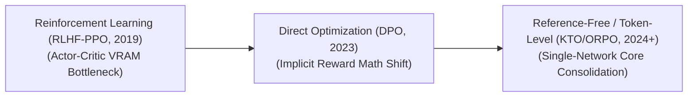

# Awesome-Preference-Optimization-Algorithms

  
   
  
  
  

## Preference Optimization Algorithms: Evolution, Variants, & Applications

Preference Optimization Algorithms align Large Language Models (LLMs) with human values, safety guidelines, and task preferences (e.g., helpfulness, accuracy, and tone). Instead of training a model purely to predict the next token from raw data, preference optimization fine-tunes the model using feedback—often structured as comparisons between "chosen" (good) and "rejected" (bad) responses. This process shifts the model's output distribution toward desirable behaviors while suppressing hallucinations, toxic text, and unhelpful answers.

---

## 🕰️ 1. The Chronological Evolution

The algorithmic progression of preference optimization reflects a transition from complex, multi-model reinforcement learning loops to simpler, direct loss formulations and stable non-referential objectives.

| Evolution Stage | Details | Year | Paper Link |
|---|---|---|---|
| [**The Reinforcement Learning Foundation (RLHF-PPO, ~2019–2023)**](pages/rlhf_ppo.md) | *Concept:* Popularized by OpenAI (InstructGPT/GPT-4). Relies on training an explicit secondary Reward Model on human preferences, followed by optimizing the base LLM policy using Proximal Policy Optimization (PPO). *Limitation:* Highly unstable to train and memory-intensive, requiring up to four active neural networks in VRAM concurrently. | 2019 | [Ziegler et al., 2019](https://arxiv.org/abs/1909.08593) |
| [**The Direct Preference Era (DPO, ~2023–2024)**](pages/dpo_era.md) | *Concept:* Introduced by Rafailov et al. Mathematically proves that the loss function can be optimized directly on pairwise data without an explicit reward model. The language model itself acts implicitly as the reward engine. *Significance:* Halved the training memory footprint and eliminated the unstable reinforcement learning actor-critic loop. | 2023 | [Rafailov et al., 2023](https://arxiv.org/abs/2305.18290) |
| [**Modern Unified & Reference-Free Optimization (~2024–Present)**](pages/modern_unified.md) | *Concept:* Moves away from rigid pairwise dependencies. Frameworks like **KTO** optimize binary metrics (Thumbs Up/Down), while architectures like **ORPO** merge Supervised Fine-Tuning (SFT) and preference alignment into a single loss layer, removing the need for a separate reference network. | 2024 | [Hong et al., 2024](https://arxiv.org/abs/2403.07651) |

---

## 📊 2. Data Structure & Feedback Variants

Preference algorithms adapt based on how feedback is formatted, curated, and scored by human annotators or automated AI evaluators.

| Data Structure Variant | Details | Year | Paper Link |
|---|---|---|---|
| [**Pairwise Preference Optimization**](pages/pairwise_preference.md) | *Mechanism:* Ingests a prompt paired with exactly two candidate responses: one explicitly tagged as *Chosen* ($y_w$) and one as *Rejected* ($y_l$). *Application:* The default structure for traditional DPO and IPO, focusing purely on relative data ranking. | 2023 | [Rafailov et al., 2023](https://arxiv.org/abs/2305.18290) |
| [**Binary Unpaired Optimization (KTO)**](pages/binary_unpaired_kto.md) | *Mechanism:* Processes isolated, single data responses tagged independently as either *Desirable* or *Undesirable* based on utility metrics. *Pros:* Highly scalable for real-world logs where data naturally arrives as single un-paired entries (e.g., user thumb-ups or abandoned chats). | 2024 | [Ethayarajh et al., 2024](https://arxiv.org/abs/2402.01306) |
| [**Listwise & Multi-Turn Preference Optimization**](pages/listwise_multi_turn.md) | *Mechanism:* Evaluates a ranked list of multiple outputs ($y_1 > y_2 > y_3$) or optimizes conversational text threads across multi-turn chat sessions where late-stage errors carry heavy weight penalties. | 2023 | [Song et al., 2023](https://arxiv.org/abs/2306.17492) |

---

## 🧠 3. Core Algorithmic Frameworks

| Algorithmic Framework | Details | Year | Paper Link |
|---|---|---|---|
| [**PPO (Proximal Policy Optimization)**](pages/ppo_framework.md) | *Type:* Actor-Critic Reinforcement Learning. *Mechanism:* Iteratively updates the LLM policy using an online reward signal while calculating a Kullback-Leibler (KL) divergence penalty against a frozen reference model to keep the model from degenerating into gibberish. | 2017 | [Schulman et al., 2017](https://arxiv.org/abs/1707.06347) |
| [**DPO (Direct Preference Optimization)**](pages/dpo_framework.md) | *Type:* Implicit Reward Cross-Entropy. *Mechanism:* Maximizes the log-likelihood of the chosen response over the rejected response by using the model's own token probabilities as log-odds indicators, backed by a static reference model. | 2023 | [Rafailov et al., 2023](https://arxiv.org/abs/2305.18290) |
| [**IPO (Identity Preference Optimization)**](pages/ipo_framework.md) | *Type:* Regularized Direct Optimization. *Mechanism:* Appends an explicit root-mean-square regularizer to DPO to prevent the model from aggressively overfitting to chosen responses or dropping formatting variation too early. | 2023 | [Azar et al., 2023](https://arxiv.org/abs/2310.12036) |
| [**KTO (Kahneman-Tversky Optimization)**](pages/kto_framework.md) | *Type:* Prospect Theory Behavioral Utility. *Mechanism:* Models the loss function to replicate human psychological value biases (where losing utility hurts more than gaining an equivalent reward), letting models learn effectively from highly imbalanced, unpaired data pools. | 2024 | [Ethayarajh et al., 2024](https://arxiv.org/abs/2402.01306) |
| [**ORPO (Odds Ratio Preference Optimization)**](pages/orpo_framework.md) | *Type:* Monolithic SFT-Preference Hybrid. *Mechanism:* Penalizes the model during standard supervised training by calculating the odds ratio of generating rejected tokens, entirely removing the computational need for an active reference model in VRAM. | 2024 | [Hong et al., 2024](https://arxiv.org/abs/2403.07651) |

---

## 🚀 4. Production & Downstream Applications

| Application | Description | Year | Paper Link |
|---|---|---|---|
| [**Red-Teaming and Safety Guardrail Hardening**](pages/red_teaming.md) | *Application:* Intentionally prompts models with dangerous or illicit topics (e.g., weapon building or cyber-attacks), optimization-training the system to choose safe refusals over helpful but harmful output instructions. | 2022 | [Bai et al., 2022](https://arxiv.org/abs/2212.08073) |
| [**Conversational Style and Persona Conditioning**](pages/conversational_style.md) | *Application:* Fine-tunes consumer chatbots to prefer short, highly structured markdown list responses over dense, unstructured text blocks, heavily reducing user processing friction. | 2022 | [Ouyang et al., 2022](https://arxiv.org/abs/2203.02155) |
| [**Complex Reasoning & Code Verification (RLAIF)**](pages/complex_reasoning.md) | *Application:* Optimizes advanced coding and math systems using Reinforcement Learning from AI Feedback (RLAIF). Compiler errors or automated test unit executions generate preference signals to guide reasoning models toward structurally sound logic. | 2023 | [Lee et al., 2023](https://arxiv.org/abs/2309.00267) |

## 🌟 Star History

<a href="https://www.star-history.com/?repos=ishandutta2007/Awesome-Preference-Optimization-Algorithms&type=date&legend=bottom-right">
<picture>
<source media="(prefers-color-scheme: dark)" srcset="https://api.star-history.com/chart?repos=ishandutta2007/Awesome-Preference-Optimization-Algorithms&type=date&theme=dark&legend=bottom-right" />
<source media="(prefers-color-scheme: light)" srcset="https://api.star-history.com/chart?repos=ishandutta2007/Awesome-Preference-Optimization-Algorithms&type=date&legend=bottom-right" />

</picture>
</a>

