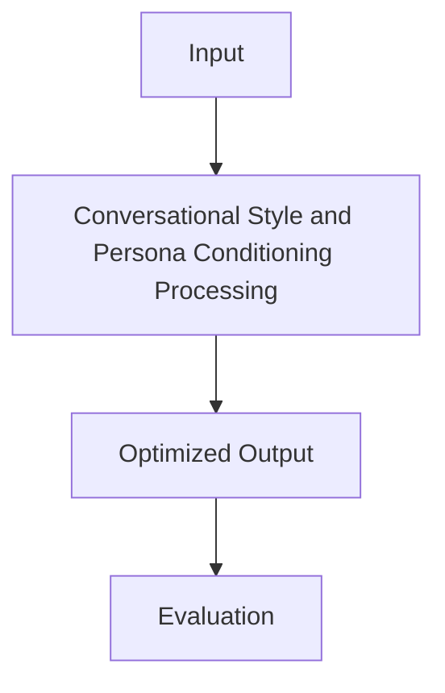

# Conversational Style and Persona Conditioning

## Detailed Information
Conversational Style and Persona Conditioning represents a significant milestone in preference optimization algorithms. This approach addresses key challenges in aligning language models with human intentions.

### Diagram

[Back to README](../README.md)
